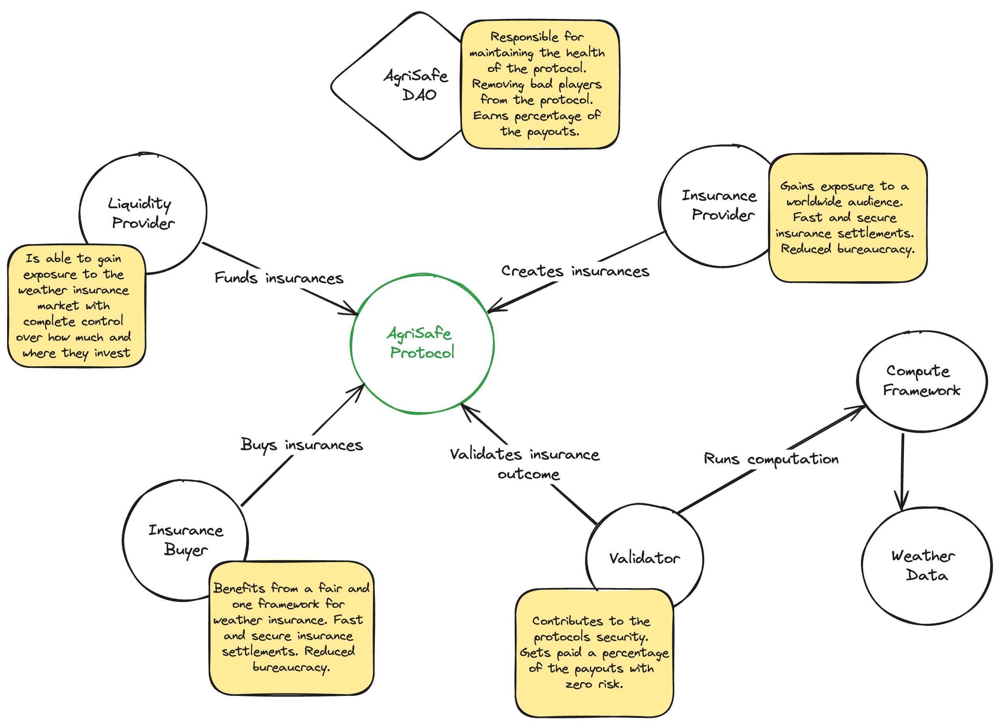

### AgriSafe

AgriSafe is a web3 agricultural insurance protocol aiming to help farmers benefit from transparency and verifiability of the blokchain.

  

    
     
  

AgriSafe is an insurance protocol that is aiming to become the new standard in weather insurance. Focusing on solving the main problems of the traditional weather insurance we are utilising transparent and verifiable computation along with open source weather data to create a more fair and beneficial insurance market. The 4 main entities involved into the protocol are:
1) The Insurance provider that is responsible for creating parametric insurances and making them available for purchase. Is responsible for the risk assessment and initial funding of these new  insurances. This will usually be and insurance company that has the know-how in order to assess the risk for a certain insurance.
2) The liquidity provider. The liquidity provider can choose to fund with extra money the insurances created the the insurance provider and thus making them more attractive to the users  and in return is entitled in part of the price paid by the user
3) The user of the platform that is purchasing one or more insurances.
4) The validators. These are responsible for running the computations that decide weather and certain insurance should be triggered or not. All the validators are responsible for evaluating every insurance and submitting the results. The validators are required to have a stake (in the native currency) in the protocol to ensure they will behave. Validators that are found to regularly submit results opposite of the majority can be penalised.

The life cycle of an insurance from creation all the way to evaluation and fulfilment would be as such: The Insurance provider creates a new insurance and specifies the parameters (weather conditions as well the location) under which the insurance will be triggered. The liquidity providers can then choose to fund this more if they think the risk is to their favour. A user will then buy the insurance and once the conditions are met, or the end period elapses without the conditions triggering, then the validators are running the required computations to prove the outcome and submit the results thus triggering either a payout to the user that bought the insurance or return of the funds to the insurance provider and liquidity providers that funded the insurance.

## Tech Stack

The project is using chainlink functions in order to call off-chain APIs to trigger the calculations for the insurance outcome and get the results on-chain. In order to have transparent and fair computations we are using https://www.bacalhau.org/ and for the weather data we are using data from https://weatherxm.network/. The open and verified data along with the transparent computations play particularly important role in the fairness of the protocol. Chainlink's functions provided us with a very flexible way to trigger off-chain computations from within the smart contract while at the same time delivering those results back on-chain.

## Built With

* [Ethereum](https://www.ethereum.org/) - Ethereum is a decentralized platform that runs smart contracts
* [Solidity](https://solidity.readthedocs.io/en/v0.5.3/) - Solidity is an object-oriented, high-level language for implementing smart contracts. Smart contracts are programs which govern the behaviour of accounts within the Ethereum state.
* [EtherJs](https://docs.ethers.org/v5/) - A general-purpose library interacting with the Ethereum Blockchain and its ecosystem.
* [Hardhat Framework](https://hardhat.org/) - Hardhat is the most popular development framework for Ethereum.
* [Bacalhau](https://github.com/bacalhau-project) - Compute over Data framework for public, transparent, and optionally verifiable computation.
* [Wagmi](https://wagmi.sh/) - Type Safe, Extensible, and Modular by design. Build high-performance blockchain frontends.
* [WorldCoin](https://worldcoin.org/) - Privacy preserving and identity managment token.
* [Chainlink Funcions](https://docs.chain.link/chainlink-functions) - Chainlink Functions provides your smart contracts access to trust-minimized compute infrastructure.
* [WeatherXM](https://weatherxm.network/) - The global, decentralized, weather network.
